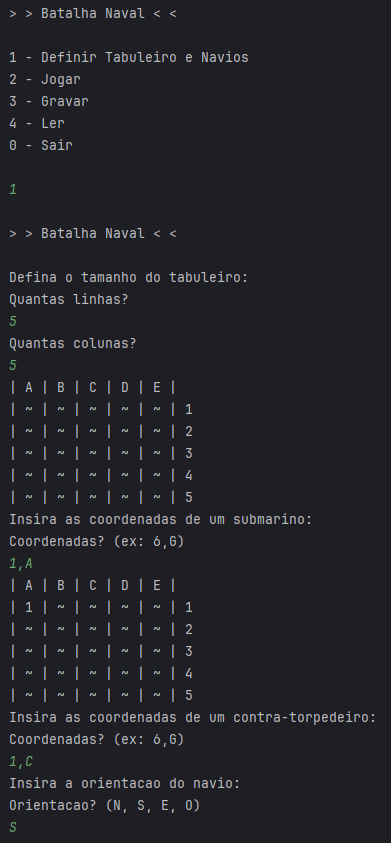
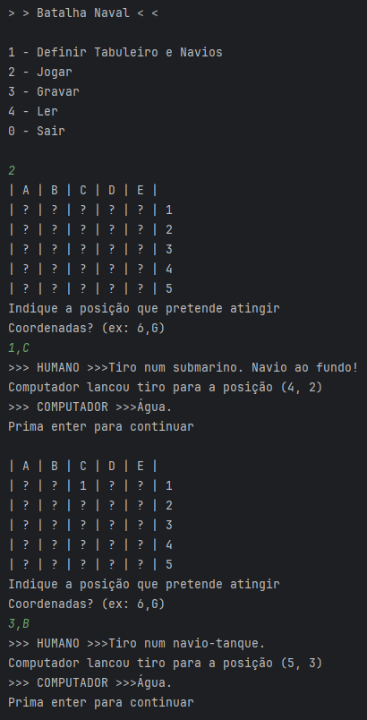
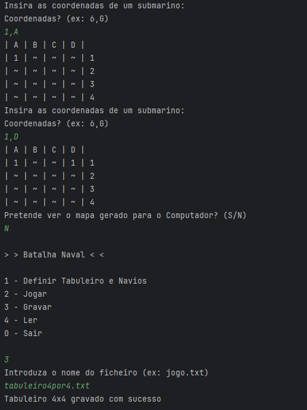
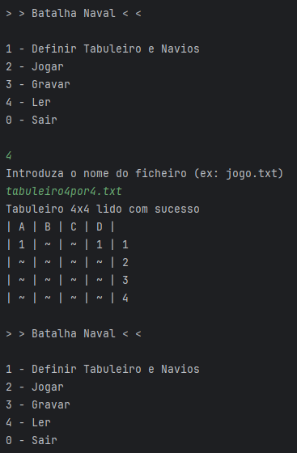

# Naval Battle - Kotlin

This project is a naval battle game made in Kotlin, developed during the first year of my BSc degree as part of the Fundamentals of Programming course.

## Special Features

- Play against a CPU.
- Options to load and save the game at any time.
- Ships with different orientations.
- Interactive menu.
- Available boards: 4x4, 5x5, 7x7, 8x8, 10x10.

## Game Examples

    
    
<em>Caption: Definition of the board</em>

    
    
<em>Caption: Shooting and game winner</em>

## Save and Load Game Examples

    
    
<em>Caption: Saving the game after defining the board</em>

    
    
<em>Caption: Loading the game saved earlier</em>

## Author

- <a href="https://github.com/amirajij" target="_blank">Amir Irshad</a>
- <a href="https://amirajij.github.io/" target="_blank">Personal Website</a>
